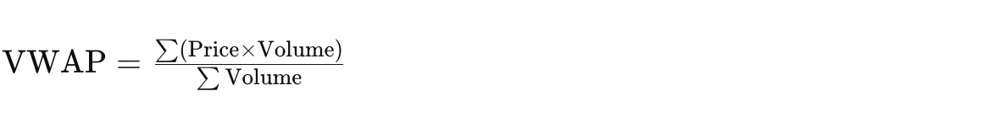
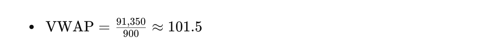

# VWAP Outlier Detection
Volume Weighted Average Price (VWAP)- A trading benchmark for average price

## What is VWAP?

VWAP is a trading benchmark used by traders and analysts that gives the average price a security has traded at throughout the day, based on both volume and price. VWAP provides a more accurate measure of the average price of a security than a simple average price calculation, as it weights the price by the volume traded at each price level.

## Calculation of VWAP

The VWAP is calculated by taking the total value of trades (price multiplied by the volume) and dividing it by the total volume of trades over a specific period. The formula can be expressed as:




### Steps to Calculate VWAP

1. **Collect Trade Data**: Gather the price and volume of each trade over the desired time period.
2. **Compute Cumulative Values**:
    - **Cumulative total value**: Sum of the products of price and volume for each trade.
    - **Cumulative total volume**: Sum of the volumes for each trade.
3. **Apply the Formula**: Divide the cumulative total value by the cumulative total volume to get the VWAP.

### Example

Suppose you have the following trades:

| Time     | Price | Volume |
|----------|-------|--------|
| 10:01:00 | 100   | 200    |
| 10:02:00 | 102   | 150    |
| 10:03:00 | 101   | 300    |
| 10:04:00 | 103   | 250    |

To calculate the VWAP:

1. **Compute the total value of trades**:
    - Trade 1: \( 100 \times 200 = 20,000 \)
    - Trade 2: \( 102 \times 150 = 15,300 \)
    - Trade 3: \( 101 \times 300 = 30,300 \)
    - Trade 4: \( 103 \times 250 = 25,750 \)
    - **Total value**: \( 20,000 + 15,300 + 30,300 + 25,750 = 91,350 \)

2. **Compute the total volume of trades**:
    - **Total volume**: \( 200 + 150 + 300 + 250 = 900 \)

3. **Apply the VWAP formula**:
   

### Interquartile Range (IQR) Method

1. **Extract Trade Prices**: First, the function extracts the prices from the Trade objects into a slice of floats.
2. **Sort Prices**: The prices are sorted in ascending order. Sorting is necessary to calculate the quartiles correctly.
3. **Calculate Q1, Q3, and IQR**
   - **Q1**: (first quartile) is the median of the lower half of the sorted prices.
   - **Q3**: (third quartile) is the median of the upper half of the sorted prices.
   - **IQR** (interquartile range) is calculated as Q3 - Q1.
3. **Filter Out Outliers**: Divide the cumulative total value by the cumulative total volume to get the VWAP.
   - Trades are considered outliers if their prices are below Q1 - 1.5*IQR or above Q3 + 1.5*IQR.
   - The function loops through the trades and filters out the ones that fall outside this range.

## Applications of VWAP

- **Trading Strategy**: Traders use VWAP to ensure they execute trades in line with the average market price, aiming to buy below the VWAP and sell above it.
- **Performance Benchmark**: VWAP is used to assess the quality of trade executions. If the execution price is better than the VWAP, it indicates a good trade.
- **Institutional Trading**: Large institutional traders use VWAP to minimize market impact when executing large orders.

## Limitations of VWAP

- **Lagging Indicator**: VWAP is a lagging indicator, meaning it reflects past prices and volumes. It does not predict future price movements.
- **Intraday Use**: VWAP is typically used for intraday analysis. Its relevance decreases over longer periods.
- **Sensitivity to Outliers**: VWAP can be influenced by large trades (outliers), which might distort the average price.

## How to Use This Repository

This repository contains a Go application that calculates the VWAP for BTC/USD and ETH/USD trading pairs, excluding outliers to improve accuracy.

### Structure

- `main.go`: Main application code.
- `trade/trade.go`: Trade processing logic.
- `trade/trade_test.go`: Unit tests for trade processing logic.

### Getting Started

1. **Clone the repository**:
   ```sh
   git clone https://github.com/mdshahjahanmiah/vwap-outlier-detection.git
   cd vwap-outlier-detection
   ```
   
2. **Run and test the application:**:
   ```sh
      go mod tidy
      go run main.go
      go test ./trade
   ```


